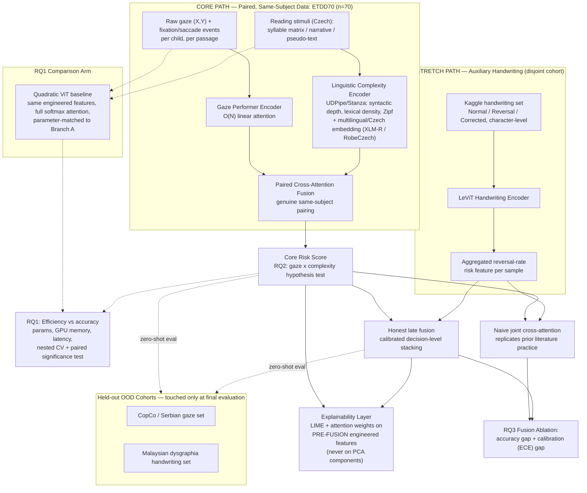

# Eco-Dysformer v2: A Lightweight, Linear-Complexity Transformer for Explainable Dyslexia Screening via Paired Gaze–Linguistic Biomarkers

**Project Proposal — Revised**

**Target Timeline:** 8 weeks | **Compute:** Single GPU instance (e.g., NVIDIA RTX 4090 / T4)

---

## 0. What Changed from v1

| Issue in v1 | Fix in v2 | RQ affected |
|---|---|---|
| Cross-attention fusion trained jointly across gaze and handwriting, which come from different children in different studies — reproduces the disjoint-cohort flaw of the closest prior work (Sait & Alkhurayyif, 2025) | Core contribution rebuilt around the genuine within-subject pairing already present in ETDD70 (every child reads three passages of differing complexity); handwriting demoted to an explicitly auxiliary, disjoint-cohort signal | RQ2 (new framing), RQ3 (new) |
| No mechanism distinguished "real" fusion from "convenient" fusion | New RQ3 turns this into a first-class, citable ablation: naive joint cross-attention vs. calibrated honest late fusion, measured on both accuracy and calibration | RQ3 |
| RQ3 (v1) claimed LIME/attention visualization could identify dyslexia "phenotypes" — no public dataset carries subtype ground truth to validate this | Reframed as interpretability-validity: do explanations align with literature-known biomarkers, not a clinical subtype-discovery claim | RQ4 (renumbered) |
| PCA bottleneck sits immediately before the explainability layer, so LIME would explain principal components a clinician cannot interpret | Explainability moved to operate on pre-fusion, original engineered features (or PCA loadings propagated back to original-feature space) | RQ4 |
| Handwriting source described only as "open handwriting datasets mapped by Sait & Alkhurayyif" — not concrete enough to build against | Named explicitly: Kaggle `dyslexia-handwriting-dataset` (drizasazanitaisa), with its actual label structure (character-level Normal/Reversal/Corrected) documented and flagged as not necessarily subject-level diagnostic | Dataset Plan |
| Evaluation section promised "cross-cohort testing" / zero-shot OOD performance, but the dataset section listed only one dataset per modality — nothing to cross-test against | One small, named, held-out OOD dataset added per modality (gaze: CopCo or the Serbian set; handwriting: the Malaysian dysgraphia set), reserved strictly for final evaluation | RQ1, RQ3 |
| Linguistic feature extraction named DistilBERT (English) and spaCy for Czech reading stimuli — both have uncertain-to-weak native Czech coverage | Syntactic depth and lexical statistics computed with UDPipe or Stanza (UDPipe was built at Charles University specifically for Czech); a multilingual or Czech-specific embedding model used only as an auxiliary semantic feature | RQ2 |
| RQ1's linear-vs-quadratic comparison risked being undermined by training transformer-style models from scratch on only 70 subjects | Comparison restricted to engineered short feature/event sequences (not raw pixels/coordinates from scratch), with time-series augmentation, nested cross-validation, and a paired significance test rather than single-split point estimates | RQ1 |
| No calibration metrics, despite RQ2's "generalizability" language | Expected Calibration Error and Brier score added throughout, especially for the RQ3 ablation and any OOD evaluation | RQ1, RQ3 |
| Full 8-week scope (3 branches + fusion + PCA + ablation + OOD + writing) had no fallback if time ran short | Explicit core/stretch tiering (Section 8) with a week-4 go/no-go checkpoint, so a complete, valid, submittable paper exists even if every stretch item is dropped | Timeline |

---

## 1. Introduction & Background

Traditional dyslexia screening remains resource-intensive, frequently language-specific, and reliant on subjective behavioral evaluation or costly neurological testing. Deep multi-modal architectures can achieve high classification accuracy but typically scale quadratically with sequence length, making them impractical for low-resource educational deployment, and several recent multi-modal dyslexia papers — including the one this project most closely follows methodologically — fuse features from entirely disjoint cohorts (different children contributing each modality), which makes any resulting "multi-modal" accuracy figure difficult to interpret as genuine cross-modal learning rather than dataset-level artifact.

Eco-Dysformer v2 addresses this directly rather than inheriting it. The project's core technical contribution is a lightweight, linear-complexity model that genuinely fuses two modalities collected from the *same children in the same sessions* — oculomotor (gaze) behavior and the linguistic complexity of the text being read — using the within-subject structure already built into the public ETDD70 dataset. A third, disjoint-cohort modality (handwriting) is incorporated honestly, as an explicitly auxiliary signal, with its own dedicated research question asking how much accuracy claims from naive disjoint-cohort fusion can be trusted in the first place.

The "Eco" framing is intentional and tied to the recognized efficiency-as-a-first-class-objective position in machine learning research (in the spirit of Schwartz et al.'s "Green AI," 2019): the project treats compute cost, parameter count, and inference latency as primary reported outcomes, not afterthoughts, which also gives the paper a clear, citable positioning beyond "another classifier."

---

## 2. Research Questions

**RQ1 — Compute Efficiency vs. Performance.** Can a linear-complexity attention mechanism (Performer-style kernelized attention) match or exceed a parameter-matched quadratic-attention baseline (standard softmax self-attention) on engineered oculomotor and linguistic features, within a single-GPU budget, with the comparison validated through nested cross-validation and a paired significance test rather than a single point-estimate?

**RQ2 — Paired Gaze–Linguistic Co-Conditioning.** Within the same children, does oculomotor behavior (fixation count, mean fixation duration, regression ratio, total read time) shift differentially between dyslexic and typical readers as linguistic complexity increases across ETDD70's syllable-matrix → narrative → pseudo-text gradient, and does a model explicitly conditioned on this paired complexity signal outperform a complexity-blind gaze-only baseline?

**RQ3 — Naive vs. Honest Multimodal Fusion.** When an auxiliary modality (handwriting) is sourced from a disjoint cohort, how much of the apparent accuracy gain from naive joint cross-attention fusion (pooling disjoint-subject features into one attention block, replicating prior comparable work) is attributable to genuine signal versus cohort-level artifact — and does a calibrated, honestly-labeled late-fusion alternative produce a more defensible result when judged on both accuracy and calibration?

**RQ4 — Explainability and Interpretability Validity.** Do LIME-based local explanations and attention-weight visualizations, computed at the level of original interpretable features rather than PCA-reduced components, align with literature-documented dyslexia biomarkers (fixation/regression patterns, letter-reversal rates) closely enough to support clinician or teacher trust — evaluated as interpretability validity, not as a claim of clinical subtype discovery?

---

## 3. Proposed Contributions

| # | Contribution | Addresses |
|---|---|---|
| C1 | Re-purposing ETDD70's existing three-passage design as a genuine within-subject linguistic-complexity manipulation, rather than treating gaze as one undifferentiated signal | RQ2 |
| C2 | A linear-complexity, Performer-based gaze–linguistic co-conditioning model, benchmarked against a parameter-matched quadratic-attention baseline under nested cross-validation and paired significance testing | RQ1 |
| C3 | An explicit empirical ablation contrasting naive disjoint-cohort joint fusion against calibrated honest late fusion, reporting both the accuracy gap and the calibration (ECE) gap — a direct, citable methodological critique-and-improvement of the closest prior work | RQ3 |
| C4 | A pre-fusion / PCA-aware explainability protocol that keeps LIME and attention attributions in clinically interpretable feature units | RQ4 |
| C5 | A small, concrete cross-cohort OOD validation step (held-out gaze and handwriting datasets) that makes the project's own evaluation claims testable, closing a gap left open in v1 | RQ1, RQ3 |
| C6 | Czech-appropriate linguistic feature extraction (UDPipe/Stanza plus a multilingual or Czech-specific embedding model), replacing English-centric tooling assumptions | RQ2 |

---

## 4. Dataset Plan

### 4.1 Core dataset — ETDD70 (paired, same-subject)

ETDD70 contains eye-tracking recordings from 70 Czech schoolchildren, aged 9–10, evenly split between clinician-diagnosed dyslexic and typical readers. Each child reads three structurally distinct passages — a syllable matrix (minimal lexical/syntactic content, isolates phonological decoding), a narrative story (naturalistic reading with full semantic and syntactic structure), and a pseudo-text (orthographically legal nonwords, isolates decoding without lexical support). Raw gaze coordinates are processed into fixation and saccade events via the I2MC algorithm with a 40 ms minimum fixation threshold. This three-passage, same-child design is the project's central asset: it is the one place where a behavioral modality (gaze) and a linguistic-complexity modality (the text itself) are genuinely paired at the individual level, with no new data collection required.

### 4.2 Auxiliary dataset — handwriting (disjoint cohort, named explicitly)

The handwriting signal draws on the Kaggle `dyslexia-handwriting-dataset` (drizasazanitaisa), containing roughly 138,500 character images labeled Normal (78,275), Reversal (52,196), and Corrected (8,029). These labels are applied at the character-image level. Before this dataset is used to build any per-sample "handwriting risk feature," Week 1 must confirm whether subject-level metadata exists linking groups of character images to individual writers and, if so, whether a clinical diagnosis label is attached at that level — if not, the feature is constructed as an aggregated reversal-rate across a writing sample, reported and discussed as a proxy signal rather than a clinically diagnostic one. This dataset is never claimed to be paired with ETDD70's children.

### 4.3 Held-out OOD validation cohorts (stretch tier, touched only at final evaluation)

| Modality | Dataset | Population | Role |
|---|---|---|---|
| Gaze | CopCo (Hollenstein et al., 2022) | 57 participants: 19 dyslexic native Danish speakers, 25 typical native, 13 non-native | Cross-lingual, cross-cohort generalization check for RQ1/RQ3 |
| Gaze (alternative) | Serbian eye-tracking set | 15 dyslexic / 15 typical, school-age | Smaller fallback if CopCo access proves harder to confirm in Week 1 |
| Handwriting | Malaysian dysgraphia set (Ramlan et al., 2024) | 83 participants, 249 images, Malay-language sentences | Cross-script, cross-cohort generalization check, distinct visual-confusion patterns from the English reversal-pair set |

These datasets are reserved strictly for final, zero-shot evaluation — never used in training, tuning, or model selection — and are explicitly a stretch-tier item (Section 8): the core pipeline does not depend on them to produce a complete result.

---

## 5. System Architecture

### 5.1 Overview

The architecture has four parts: a core path that genuinely fuses paired gaze and linguistic-complexity data from the same children; a parallel comparison arm that benchmarks linear against quadratic attention on that same core data (RQ1); a stretch path that brings in the disjoint-cohort handwriting signal through two competing fusion strategies so they can be honestly compared (RQ3); and an explainability layer that operates on original, interpretable features rather than reduced components (RQ4).

### 5.2 Architecture Diagram

### 5.3 Component Notes

- **Paired Cross-Attention Fusion (core):** unlike the disjoint-cohort fusion this project explicitly avoids replicating, this attention block is trained on genuinely paired (subject, passage) examples — every input pair really did come from the same child reading that specific text — so a learned cross-attention layer is methodologically defensible here in a way it is not for the handwriting branch.
- **RQ1 comparison arm:** trained on the same engineered feature inputs as the core path (not raw pixels or coordinate streams from scratch), specifically because 70 subjects is too little data to train either a Performer or a full quadratic-attention transformer reliably from raw signals; restricting both to short, already-engineered sequences keeps the comparison about attention complexity, not about which model overfits less on raw high-dimensional input.
- **Naive vs. honest fusion (RQ3):** the naive branch intentionally reproduces how the literature typically performs cross-modality fusion — pooling features from unrelated cohorts into one joint attention block — so that its output can be directly compared against the honest, calibrated late-fusion branch on the same downstream task. A secondary, low-cost benefit: running the explainability layer on both fusion variants (not just the honest one) lets attribution quality itself serve as supporting evidence for RQ3 — if the naive branch's top attributed features look biomarker-implausible compared to the honest branch's, that strengthens the case that naive fusion is fitting cohort artifacts rather than real cross-modal signal.
- **Explainability layer:** deliberately placed before any PCA step (or, if PCA is retained for dimensionality reduction elsewhere in the pipeline, its loading matrix is propagated backward so attributions are reported in original-feature units), since a clinician or teacher cannot act on "Principal Component 3."
- **Classification head:** LightGBM is the default downstream classifier, chosen over a full XGBoost-with-dropout variant specifically because it is lighter and faster to tune within an 8-week, single-GPU budget, consistent with the project's efficiency framing; a Dartbooster XGBoost (DXB) configuration can be run as a secondary comparison point if time allows, but is not the primary reported model.

---

## 6. Methodology

### 6.1 Gaze encoder

A Performer-style block with kernelized random-feature attention processes the engineered fixation/saccade event sequence (fixation count, mean fixation duration, regression ratio, total read time, computed per passage per child), chosen for linear memory scaling and because this compact, literature-validated feature set is the one most likely to remain robust given the dataset's size.

### 6.2 Linguistic complexity encoder

Because ETDD70's stimuli are Czech, syntactic dependency depth and lexical statistics are computed with UDPipe or Stanza rather than spaCy, whose native Czech dependency-parsing coverage is not reliably confirmed as a full trained pipeline (UDPipe, developed at Charles University, has long-standing, well-validated Czech treebank support and is the safer default). Lexical density (content words / total words) and word-frequency-based Zipf scores are computed directly from frequency tables rather than inferred from a neural language model, since these are well-defined, directly computable quantities. A multilingual or Czech-specific embedding model (e.g., XLM-R, or a Czech-specific model such as RobeCzech if available and verified in Week 1) supplies an additional semantic-complexity feature, used as a supplementary signal rather than the primary source of the named linguistic metrics.

### 6.3 Handwriting encoder (stretch)

A LeViT block — combining convolutional stages with lightweight vision-transformer patches — processes handwriting images from the Kaggle dataset, producing an aggregated per-sample reversal-rate feature once the dataset's subject-linkage structure is confirmed (Section 4.2).

### 6.4 Fusion strategies

The core path uses a single learned cross-attention block over the paired gaze and linguistic embeddings. For the stretch-tier handwriting comparison, the naive branch concatenates and jointly attends over gaze, linguistic, and handwriting embeddings exactly as prior comparable work does; the honest branch instead calibrates the handwriting risk feature independently (via Platt or isotonic scaling) and combines it with the core risk score through a small decision-level meta-classifier, so no claim of joint subject-level learning is made for a modality that does not support one.

### 6.5 Classification and explainability

LightGBM serves as the primary downstream classifier across all branches, operating on the fused (or, for the core path, paired-fused) feature representation. LIME and attention-weight visualization are applied at the pre-fusion, per-modality feature level — fixation count, regression ratio, syntactic depth, reversal rate, and so on — so that attributions remain in units a teacher or clinician can directly interpret, consistent with the goal stated in RQ4.

### 6.6 Statistical rigor for small-N evaluation

Given the core dataset's size (n=70), all RQ1 and RQ2 comparisons use nested cross-validation with subject-wise folds (no child's data crosses train/test within a fold), combined with time-series-appropriate augmentation (jitter, time-warping, segment permutation, applied only within a fold's training partition) to reduce overfitting risk. Headline comparisons (Performer vs. quadratic baseline; complexity-conditioned vs. complexity-blind) are reported with confidence intervals across folds and validated with a paired Wilcoxon signed-rank test, rather than as single-split point estimates.

---

## 7. Evaluation Metrics

### 7.1 RQ1 — Compute efficiency vs. performance

| Metric | Purpose |
|---|---|
| Accuracy, F1, AUROC (nested CV, mean ± CI) | Core comparison between Performer and quadratic-attention baseline |
| Wilcoxon signed-rank test across folds | Statistical defensibility of "matches or exceeds" claims |
| GPU memory peak (MB), parameter count, training time per epoch | Direct evidence for the efficiency claim |

### 7.2 RQ2 — Paired gaze–linguistic co-conditioning

| Metric | Purpose |
|---|---|
| Effect size (Cohen's d) of fixation/regression shift across the three passage types, dyslexic vs. typical | Direct test of the core scientific hypothesis |
| Accuracy/F1 of complexity-conditioned model vs. complexity-blind gaze-only baseline | Whether conditioning measurably helps classification |
| Paired significance test between the two | Same rigor standard as RQ1 |

### 7.3 RQ3 — Naive vs. honest fusion ablation

| Metric | Purpose |
|---|---|
| Accuracy/F1 gap, naive joint fusion vs. honest late fusion | Quantifies how much of naive fusion's apparent gain survives honest treatment |
| Expected Calibration Error, Brier score, both branches | Calibration is often where naive fusion's overconfidence shows up even when raw accuracy looks similar |
| Top-feature attribution comparison (qualitative) | Whether naive fusion's explanations look biomarker-plausible or artifact-driven, as supporting evidence |

### 7.4 RQ4 — Explainability and interpretability validity

| Metric | Purpose |
|---|---|
| Proportion of top-5 LIME-attributed features matching literature-documented biomarkers | Quantified face-validity check |
| Attribution stability across folds | Whether explanations are consistent (trustworthy) or noisy |

### 7.5 Reproducibility and accessibility

| Metric | Purpose |
|---|---|
| Full pipeline reproducibility from public sources only | No institutional data access required to replicate |
| Quantized/compressed model size, inference latency on consumer hardware | Ties directly to the project's efficiency framing |

---

## 8. Scope Tiering — Core vs. Stretch

| Tier | Includes | If dropped |
|---|---|---|
| **Core (must-finish)** | ETDD70 paired gaze–linguistic fusion (RQ2's hypothesis test), Performer-vs-quadratic efficiency comparison (RQ1), pre-fusion explainability (RQ4, core path only) | Not droppable — this alone is a complete, valid, submittable paper |
| **Stretch, priority 1** | Handwriting auxiliary branch + naive-vs-honest fusion ablation (RQ3) | Paper remains complete without it; RQ3 is simply not reported |
| **Stretch, priority 2** | Held-out OOD cohort evaluation (CopCo/Serbian gaze, Malaysian handwriting) | Generalization claims are scoped to ETDD70 alone instead |
| **Stretch, priority 3** | Czech-specific embedding refinement (e.g., RobeCzech over generic multilingual XLM-R) | Multilingual embedding remains as a reasonable fallback |

A go/no-go checkpoint is built into the timeline at the end of Week 4: if the core path is solid, proceed to stretch items in priority order; if behind schedule, Weeks 5–6 are used to harden the core instead of starting new branches.

---

## 9. Implementation Timeline (8 Weeks)

| Week | Activities |
|---|---|
| 1 | Verify ETDD70 access/structure; confirm Kaggle handwriting dataset's exact label/metadata structure and subject-linkage (or lack thereof); set up UDPipe/Stanza Czech pipeline; set up multilingual/Czech embedding model |
| 2 | Core feature engineering: gaze features per passage per child; linguistic complexity features (syntactic depth, lexical density, Zipf, embeddings) per passage |
| 3 | Build core model: Gaze Performer encoder, Linguistic encoder, Paired Cross-Attention Fusion; build the parallel quadratic-ViT baseline arm; initial training runs |
| 4 | Core evaluation: nested CV, augmentation, paired significance testing for RQ1; effect-size analysis across passage types for RQ2 — **go/no-go checkpoint** |
| 5 | *(Stretch, if on schedule)* Handwriting LeViT encoder; naive joint fusion and honest late fusion implementations |
| 6 | *(Stretch)* RQ3 ablation evaluation (accuracy + ECE gap); OOD cohort integration if time allows |
| 7 | Explainability pipeline (pre-fusion LIME/attention visualization) across completed branches; final validation checks |
| 8 | Paper drafting and submission package |

---

## 10. Positioning and Publication Target

Given a core dataset of 70 subjects, the appropriate target is a workshop paper or short paper at an ML-for-health, learning-disabilities-adjacent, or efficient-AI venue — not a claim of clinical validity at full-journal scale. The paper should be framed explicitly in relation to Sait & Alkhurayyif (2025): not as a re-skin substituting Performer/LeViT for SWIN/Linformer, but as a methodological response that (a) demonstrates a genuine within-subject alternative where one is available in the data, and (b) directly measures, via RQ3, how much accuracy in disjoint-cohort fusion approaches like theirs may not survive an honest treatment. The "Eco" framing connects naturally to the efficiency-as-first-class-objective position associated with "Green AI" (Schwartz, Dodge, Smith, & Etzioni, 2019), which is worth citing directly as it gives RQ1's contribution a recognized academic home beyond a single architecture swap.

---

## 11. Limitations

The core RQ2 result, however statistically sound, is drawn from a single-language, 70-subject cohort; generalization beyond Czech and beyond ETDD70's specific protocol is unverified unless the OOD stretch tier is completed. RQ3's ablation demonstrates a fusion-honesty gap on this specific auxiliary dataset and cohort pairing — it demonstrates and quantifies the risk rather than proving naive fusion is always inflated in every setting. The handwriting auxiliary signal's validity depends on confirming the Kaggle dataset's actual label semantics in Week 1; if no subject-level linkage exists, this should be reported plainly rather than implied away. Finally, the 8-week, single-GPU constraint inherently limits hyperparameter search depth and ablation breadth; results should be framed as a first rigorous pass, with a longer-horizon, same-subject multimodal collection effort (the direction explored in this project's earlier Plan A) remaining the natural next step if resources allow — and the core paired gaze-linguistic encoder built here would transfer directly as a pretrained component if that path is pursued later.

---

## 12. Key References

1. Wahab Sait, A. R., & Alkhurayyif, Y. (2025). Lightweight hybrid transformers-based dyslexia detection using cross-modality data. *Scientific Reports*, 15:17054. *(Methodologically engaged with directly — both built upon and critiqued via the RQ3 ablation.)*
2. Sedmidubsky, J., Dostalova, N., Svaricek, R., & Culemann, W. (2024). ETDD70: Eye-tracking dataset for classification of dyslexia using AI-based methods. *International Conference on Similarity Search and Applications*, Springer; dataset archived on Zenodo.
3. Hollenstein, N., et al. (2022). CopCo: The Copenhagen Corpus of eye-tracking data for reading.
4. Ramlan, S., et al. (2024). Malaysian dysgraphia handwriting dataset, as referenced in "Towards Accessible Learning: Deep Learning-Based Potential Dysgraphia Detection and OCR..." (arXiv, 2024).
5. Kaggle `dyslexia-handwriting-dataset` (drizasazanitaisa).
6. Schwartz, R., Dodge, J., Smith, N. A., & Etzioni, O. (2019). Green AI. *Communications of the ACM* / arXiv preprint.
7. Straka, M., & Straková, J. UDPipe: Trainable pipeline for tokenizing, tagging, lemmatizing and parsing Universal Treebanks, developed at Charles University, Prague.
8. Tiwari, V., et al. (2025). Akshar Mitra: a multimodal integrated framework for early dyslexia detection. *Frontiers in Digital Health*, 7:1726307. *(Background context on accessible, consumer-hardware dyslexia screening.)*

---

*Dataset access, exact label structures, and current hosting status for items 2–5 above should be re-verified directly at each source during Week 1 — this is the first task on the timeline, not an assumption carried into model development.*
